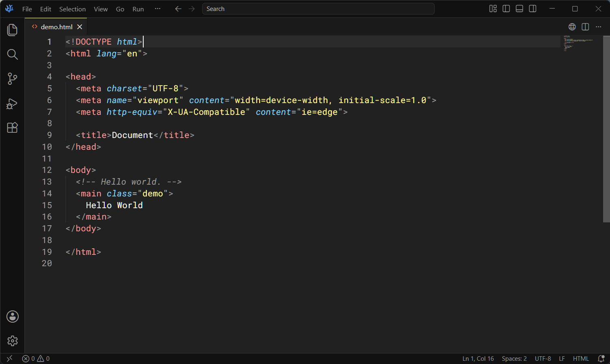
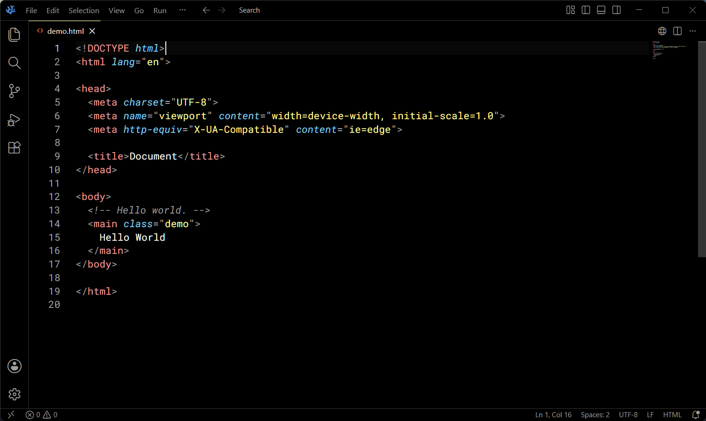

# Kaia for Visual Studio Code

A dark, Monokai-inspired theme for Visual Studio Code with accessible
contrast, restrained pastel syntax colors, and a pale-yellow accent.

## Theme variants

**Kaia** is the maintained dark theme with Monokai-inspired color and accessible contrast.



**Kaia OLED** is the maintained true-black variant, retaining structural borders for separation.



**Kaia - Old** and **Kaia Subtle - Old** remain selectable for historical comparison.

## Installation

1.  In Visual Studio Code, search for `Kaia` in the extensions side bar and install it.
1.  Click **Reload** to reload Visual Studio Code to make the extension available.
1.  From the gear menu or the Show All Commands (CTRL + SHIFT + P) menu select: Color Theme > **Kaia**.

### Test a local build on Windows

Install [Node.js 20](https://nodejs.org/) and make sure the Visual Studio Code `code` command is available, then run these commands from PowerShell in the repository directory:

```powershell
npm ci
npm run package:vsix
code --install-extension .\kaia-theme-vscode.vsix --force
```

Alternatively, after running `npm run package:vsix`, open the Extensions view in Visual Studio Code, select the `...` menu, choose **Install from VSIX...**, and select `kaia-theme-vscode.vsix`.

Reload Visual Studio Code when prompted. Open the Command Palette with `Ctrl+Shift+P`, run **Preferences: Color Theme**, and test each Kaia variant. To test a new build, run the package and install commands again; `--force` replaces the installed local version.

To remove the test installation:

```powershell
code --uninstall-extension ryan0x200.kaia-theme-vscode
```

## Development

The generated themes are derived from the typed `VariantDefinition` registry and hexadecimal semantic roles in `src/`, plus the committed VS Code 1.130.0 dark workbench reference. `culori` validates color parsing and WCAG contrast in the audit.

```sh
npm ci
npm run check
```

`npm run build:themes` deterministically writes the committed generated themes. Do not edit those JSON files by hand. `npm run audit:themes` writes the committed generated audit report and checks contrast, coverage, and polarity. Normal build/check commands use only committed inputs and are offline-capable.

`npm run refresh:vscode-reference` is the explicit network-only maintenance command. It clones the pinned `1.130.0` VS Code tag, extracts `registerColor()` registrations, and updates `references/vscode-1.130.0-workbench-colors.json`. Review the resulting inventory before committing an intentional refresh.

The legacy files are parsed in memory as JSONC because VS Code color themes permit comments and trailing commas. They are never formatted or rewritten.
