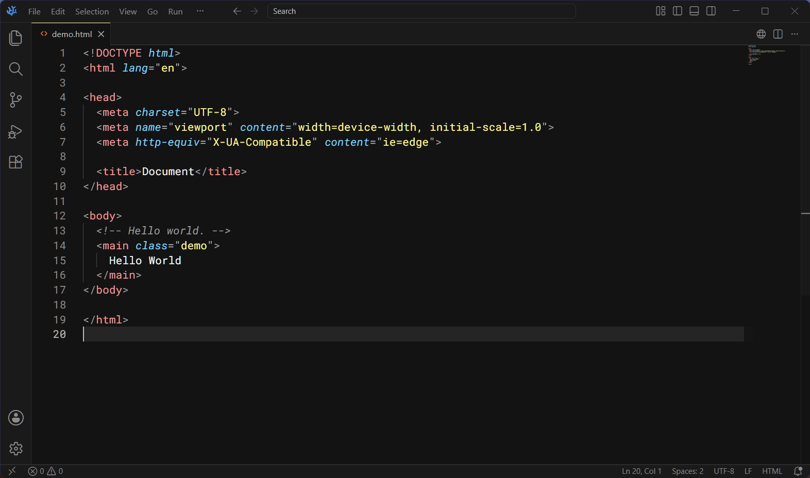

# Kaia for Visual Studio Code

A collection of dark Kaia color themes for Visual Studio Code.

## Theme variants

1. **Kaia** — derived from VS Code Dark 2026 with grayscale surfaces and Kaia syntax.
2. **Kaia OLED** — derived from VS Code Dark 2026 with black surfaces and Kaia syntax.
3. **Kaia - Old** — preserved for historical comparison.
4. **Kaia Subtle - Old** — preserved for historical comparison.